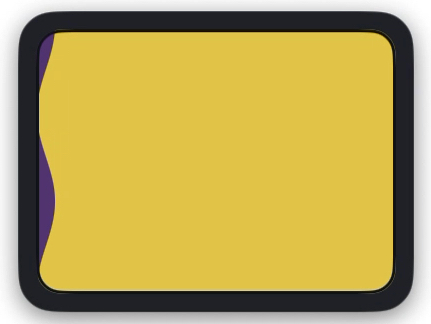
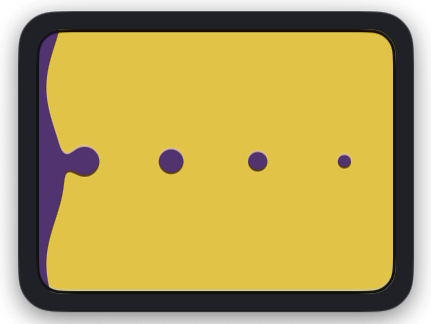
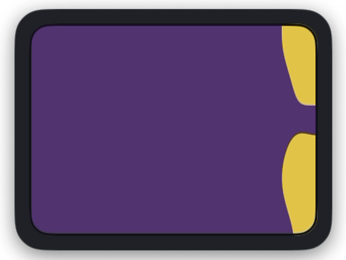
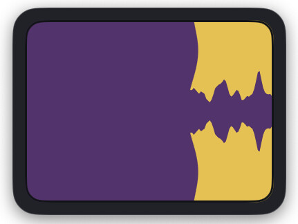
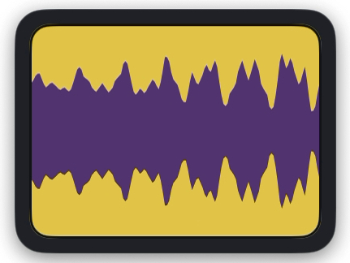
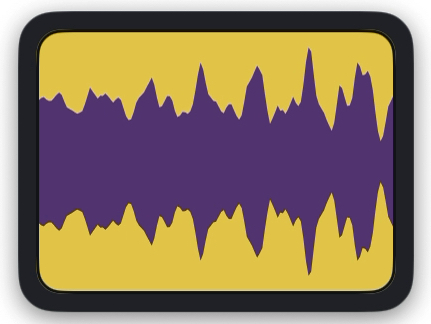
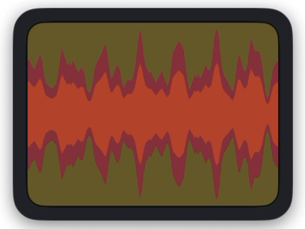
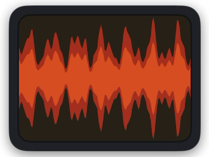

# メーター値の段階遷移サンプル

Gigant Monitor の `IndustriaMeter` が値 0〜100% でどう変化するかを示すスクリーンショット集。
宮崎駿『未来少年コナン』(1978) インダストリアのエネルギーメーターをモチーフにした
液体メーターは、CPU 使用率 / ネットワークトラフィック / 消費電力（Pro 限定）の可視化に
使われている。

数値そのものを正確に読み取るためのものではなく、**値の動きを「眺めて楽しむ」**ための
段階表現になっている。

---

## 段階の早見表

| 範囲 | 様子 | 状態 |
|---|---|---|
| **0〜10%** | 左端の小さな粒（メタボール）が分離してデスクトップへ流れる | アイドル |
| **10〜50%** | 左から液体が侵入、メタボール接続で繋がる「壁」状になる | 軽負荷 |
| **50〜71%** | 壁が右へ伸び、画面の半分以上を液体が満たす | 中負荷 |
| **71〜85%** | 壁の伸びが止まり、メタボールが千切れて再分離 | 高負荷の前段 |
| **80〜90%** | 上下にギザギザの波形が生え始める | 高負荷 |
| **90〜95%** | ギザギザが画面全体に広がる | 高負荷 |
| **95〜100%** | 赤い過負荷波形に置き換わり、背景も暗緑〜暗赤へ | 過負荷（DANGER） |

---

## サンプル画像

### 0%

完全な静止状態。左端の小さな紫の粒だけが見える。背景の黄色いパネルがほぼ全面。

### 10%

液体が左から侵入し始める。メタボール表現で「壁」と「千切れた粒」が同時に描かれる
（粒は右へ流れていくアニメーション）。

### 50%

液体が半分まで到達。メタボールの曲率がはっきりと出る境界面。右側にはまだ黄色が残っている。

### 80%

液体が画面の大半を占有。右端に黄色が小さく残るだけ。壁の右端が「千切れ」始める直前の形。

### 82%

壁モードからギザギザモードへの**移行段階**。左半分はまだ滑らかな液体の壁を保ったまま、右端から鋸状の波形が生え始める。80% の「千切れる直前」と 90% の「全面ギザギザ」の中間で、メタボール表現が崩れ始める瞬間が見える。

### 90%

ギザギザ（鋸状の波形）モードに入る。上下から黄色がランダムに食い込み、紫の液体が
脈打つように見える。これより上は「眺めて楽しい」過負荷表現の領域。

### 95%

ギザギザがさらに広がる。紫の帯はまだ中央に残るが、振幅は大きい。

### 98%

赤い過負荷波形に切り替わる。背景は暗緑にくすみ、紫は赤紫へ変質。完全に赤に染まる
直前の遷移段階。

### 100%

完全な DANGER 表示。背景は暗赤、波形は鮮やかな赤、紫は消えている。最大強度の警告。

---

## メモ

- これらは Network メーターの **正方向**（上りメーター = 左から右流れ、`gigantGreen`
  テーマではなく CPU 用 `default` 紫テーマ）で撮影したスクリーンショット。CPU メーターの
  紫テーマと同じ見た目。
- 下り（rx）は `MeterRenderer` 内の `GraphicsContext.scaleBy(x: -1)` で水平反転される
  ため、同じパーセンテージでも液体は **右から左** へ流れる。
- Pro 版の消費電力メーターは `gigantAmber`（赤系 `#BC1D13`）に置き換わるが、段階遷移の
  ロジックは同じ。
- 過負荷色：通常 `overloadWaveform = #B83418` / hot `overloadWaveformHot = #E05A24` /
  背景 `overloadBackground = #161012`（`IndustriaMeterThemes.swift` 定義）。
